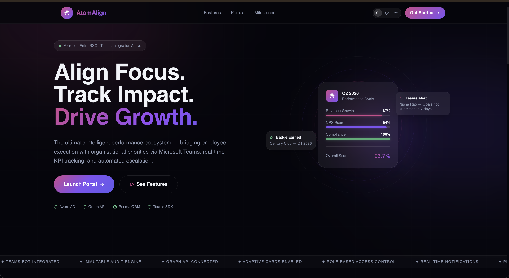

# AtomAlign — Enterprise Goal Tracking Portal
<p align="center">
  
</p>

AtomAlign is a high-performance, enterprise-grade goal-tracking and performance-acceleration platform. Designed for modern corporate structures, it shifts performance management from passive quarterly logs into active, real-time momentum building.

The system supports macro-level organization governance via an **HR Admin Workspace** and micro-level team coaching, workload metrics, and automated cross-project tracking via the **Manager Command Center**.

---

## 🛠️ Tech Stack & Architecture

AtomAlign is architected as a decoupled monorepo:

* **Frontend:** Vite + React, Tailwind CSS (Custom Dark Theme with Fuchsia/Neon Pink gradients)
* **Backend:** Node.js + Express.js API Gateway
* **Database & ORM:** PostgreSQL managed via Prisma ORM
* **Authentication:** Clerk Enterprise Authentication
* **Integration Framework:** Microsoft Graph API / Azure AD OAuth 2.0 Engine

---

## 📂 Repository Structure

```text
atom_align/
├── backend/                  # Express.js Application Server
│   ├── models/               # Shared business logic schemas
│   ├── prisma/               # Database connection strings & migrations
│   │   ├── schema.prisma     # Prisma Data Core Schema
│   │   └── seedData.js       # Enterprise mock database seeds
│   ├── routes/               # Modular Express API routing engines
│   └── utils/                # Token managers & Microsoft Graph SDK handlers
└── frontend/                 # Vite Web Application Canvas
    ├── src/                  # React source components
    │   ├── components/       # Reusable dark-mode UI dashboard elements
    │   └── main.jsx          # Microsoft Teams JavaScript Client SDK Init
    ├── tailwind.config.js    # Neon theme configurations
    └── vite.config.js        # Build pipeline optimization configs

## 🔑 Authentication & Workspace Setup

To establish flawless data synchronizations across the application layers, capture and verify your API keys using the exact workspace management screens outlined below.

---

### 👥 Test Credentials by Role

| Role | Email | Password |
| :--- | :--- | :--- |
| **Admin** | `admin1@test.com` | `password` |
| **Manager** | `manager@test.com` | `password` |
| **Employee** | `nisha@test.com` | `password` |

> ⚠️ **Note:** These credentials are for staging and development verification only. Never commit production API keys or credentials to version control.